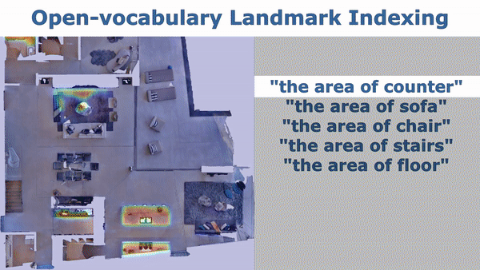

# VLMaps
[](https://github.com/psf/black)
[](https://colab.research.google.com/drive/1xsH9Gr_O36sBZaoPNq1SmqgOOF12spV0?usp=sharing)
[](https://opensource.org/licenses/MIT)
[](https://vlmaps.github.io/)
[](https://blog.research.google/2023/03/visual-language-maps-for-robot.html?m=1)


[<b>Visual Language Maps for Robot Navigation</b>](https://arxiv.org/pdf/2210.05714.pdf)

[Chenguang Huang](http://www2.informatik.uni-freiburg.de/~huang/), [Oier Mees](https://www.oiermees.com/), [Andy Zeng](https://andyzeng.github.io/), [Wolfram Burgard](http://www2.informatik.uni-freiburg.de/~burgard)

We present **VLMAPs** (**V**isual **L**anguage **Maps**),  a spatial map representation in which pretrained visuallanguage model features are fused into a 3D reconstruction of the physical
world. Spatially anchoring visual language features enables *natural language indexing in the map*, which can be used to, e.g., localize landmarks
or spatial references with respect to landmarks – enabling zero-shot spatial
goal navigation without additional data collection or model finetuning.


# Approach


# Quick Start

Try VLMaps creation and landmark indexing in [](https://colab.research.google.com/drive/1xsH9Gr_O36sBZaoPNq1SmqgOOF12spV0?usp=sharing)

## Dependencies installation

To begin on your own machine, clone this repository locally
```bash
git clone https://github.com/vlmaps/vlmaps.git
```
Install requirements:
```bash
$ conda create -n vlmaps python=3.8 -y  # or use virtualenv
$ conda activate vlmaps
$ conda install jupyter -y
$ cd vlmaps
$ bash install.bash
```

## Run Demo
```bash
git checkout demo
```

Start the jupyter notebook
```bash
$ jupyter notebook demo.ipynb
```

# Advanced Usage
Use the `master` branch
```bash
git checkout master
```

## Generate Dataset
To build VLMaps for simulated environments, we manually collected 10 sequences of RGB-D videos among 10 scenes in Habitat simulator with Matterport3D dataset. We provide script and pose meta data to generate the RGB-D videos. Please follow the next few steps to generate the dataset.

### Download Matterpot3D dataset
Please check [Dataset Download](https://niessner.github.io/Matterport/), sign the [Terms of Use](http://kaldir.vc.in.tum.de/matterport/MP_TOS.pdf), and send to the responsible person to request the Matterport3D mesh for the use in Habitat simulator. The return email will attach a python script to download the data. Copy and paste the script to a file `~/download_mp.py`. Run the following to download the data:

```bash
cd ~
# download the data at the current directory
python2 download_mp.py -o . --task habitat
# unzip the data
unzip v1/tasks/mp3d_habitat.zip
# the data_dir is mp3d_habitat/mp3d
```

### Generate Dataset

* Configure the `config/generate_dataset.yaml`.
    * Change the value for `defaults/data_paths` in `config/generate_dataset.yaml` to `default`.
    * Change the `habitat_scene_dir` and `vlmaps_data_dir` in `config/data_paths/default.yaml` according to the following steps.
    * Change the `habitat_scene_dir` to the downloaded Matterport3D dataset `~/mp3d_habitat/mp3d`.
        ```
        # the structure of the habitat_scene_dir looks like this
        habitat_scene_dir
          |-5LpN3gDmAk7
          |   |-5LpN3gDmAk7.glb
          |   |-5LpN3gDmAk7_semantic.ply
          |   |-...
          |-gTV8FGcVJC9
          |   |-gTV8FGcVJC9.glb
          |   |-gTV8FGcVJC9_semantic.ply
          |   |-...
          |-jh4fc5c5qoQ
          |   |-jh4fc5c5qoQ.glb
          |   |-jh4fc5c5qoQ_semantic.ply
          |   |-...
          ...
        ```
    * Change the `vlmaps_data_dir` to downloaded dataset
        ```
        # the structure of the vlmaps_data_dir looks like this
        vlmaps_data_dir
          |-5LpN3gDmAk7_1
          |   |-poses.txt
          |-gTV8FGcVJC9_1
          |   |-poses.txt
          |-jh4fc5c5qoQ_1
          |   |-poses.txt
          ...
        ```
    * Change `data_cfg.resolution.w` and `data_cfg.resolution.h` to adjust the resolution of the generated rgb, depth, and semantic images.
    * Change `rgb`, `depth`, and `semantic` to `true` to generate corresponding data, and to `false` to ignore corresponding data.
    * Change `camera_height` to change the height of camera relative to the robot base

    ```bash
    # go to <REPO_ROOT>/dataset of this repository
    cd dataset
    # the generated dataset will be in the same
    python generate_dataset.py
    ```

### Collect your own data in Habitat-Sim

Run the following code to collect your own data (for example for scene `gTV8FGcVJC9`):

```python
python dataset/collect_custom_dataset.py scene_names=["gTV8FGcVJC9"]
```

The generated data folder will be `<scene_name>_<id>` under `vlmaps_data_dir` in `config/data_paths/default.yaml` (If you already set the `data_paths` to `default`). The `<scene_name>` is `gTV8FGcVJC9` for the above command, and the `<id>` depends on the existing data folders for this scene. If `gTV8FGcVJC9_1` exists, then the new folder name will be `gTV8FGcVJC9_2`.

## Create a VLMap with the Generated Dataset
* Change the value for `defaults/data_paths` in `config/map_creation_cfg.yaml` to `default`.
* Change the `habitat_scene_dir` and `vlmaps_data_dir` in `config/data_paths/default.yaml` according to the steps in the **Generate Dataset** section above.
* Run the following command to build the VLMap. The code builds a 3D map where each voxel contains the LSeg embedding.
    ```bash
    cd application
    python create_map.py
    ```

    

### Config the Created VLMap
* Change the scene you want to generate VLMap for by changing `scene_id` (0-9) in `config/map_creation_cfg.yaml`. If you use your customized data, `scene_id` indicates the id of the sorted subfolder under `vlmaps_data_dir` path you set in `config/paths/default.yaml`.
* Customize the map by changing the parameters in `config/params/default.yaml`
  * Change the resolution of the map by changing `cs` (cell size in meter) and `gs` (grid size)
* Customize the camera pose and base pose by changing `config/vlmaps.yaml`. Change the `pose_info` section.
  * `pose_type` means the type of poses stored in `poses.txt` files. Set it to `mobile_base` when the poses are the poses for the base on the robot, and set it to `camera_base` when the poses are the poses for the camera. 
  * `rot_type` means the format of data you save at each line of the `poses.txt` file. Set it to `quat` if you save the pose as `px, py, pz, qx, qy, qz, qw`. Set it to `mat` if you save the flattened (4, 4) transformation matrix at each line. By default, it is set to `quat`.
  * If you set `pose_type` as `mobile_base`, you should also modify the following parameters in `pose_info`:
    * `camera_height` means the camera height relative to the base. Change it if you set different camera height when you generate the dataset.
    * `base2cam_rot` means the row-wise flattened rotation matrix from robot base to the camera coordinate frame (z forward, x right, y down).
    * `base_forward_axis`, `base_left_axis`, `base_up_axis`: your robot base coordinate. They mean what is the coordinate of the forward unit vector [1, 0, 0] projected into your robot base frame, the coordinate of the left unit vector [0, 1, 0] projected into your robot base frame, the coordinate of the upward unit vector [0, 0, 1] projected into your robot base frame.
* Other settings in `config/vlmaps.yaml`
  * `skip_frame` means that only when `frame_i % skip_frame == 0` do we use the frame
  * `cam_calib_mat` is the flattened camera intrinsics matrix
  * `depth_sample_rate`: we only back project randomly sampled `h * w / depth_sample_rate` pixels at each frame. You can change this to a higher value to increase the mapping speed at the cost of having a sparser point cloud at each frame.

## Index a VLMap
* Change the value for `defaults/data_paths` in `config/map_indexing_cfg.yaml` to `default`.
* Change the `habitat_scene_dir` and `vlmaps_data_dir` in `config/data_paths/default.yaml` according to the steps in the **Generate Dataset** section above.
* Run the following command to index a VLMap you built
    ```bash
    cd application
    python index_map.py
    ```

    

### Configure the Indexing
* Change the file `config/map_indexing_cfg.yaml`
  * `decay_rate`: set the heatmap decay rate. When it is smaller, the transition of the heat is clearer and covers larger area.
  * `index_2d`: set it to `True` to visualize 2D heatmap. Set it to `False` to visualize 3D heatmap.
  * `init_categories`: set it to `True` to provide a fix list of categories (MatterPort3D categories) to pick from indexing (for details you can check [vlmaps/utils/matterport3d_categories.py](vlmaps/utils/matterport3d_categories.py)). When you query with your text, the code will use GPT to find the nearest category in the fixed list. Set it to `False` to just use your input query for indexing. If you set it to `True`, you need to set an environment variable `OPENAI_KEY` to your OPENAI API tokens by running `OPENAI_KEY=xxx` in your terminal.

## Test Navigation

### Setup OpenAI
In order to test object goal navigation and spatial goal navigation tasks with our method, you need to setup an OpenAI API account with the following steps:
1. [Sign up an OpenAI account](https://openai.com/blog/openai-api), login your account, and bind your account with at least one payment method.
2. [Get you OpenAI API keys](https://platform.openai.com/account/api-keys), copy it.
3. Open your `~/.bashrc` file, paste a new line `export OPENAI_KEY=<your copied key>`, and save the file.


### Run Object Goal Navigation

1. Run object goal navigation. The code will load tasks specified in `<scene_folder>/object_navigation_tasks.json`. The results will be saved in `<scene_folder>/vlmap_obj_nav_results/`. 
    ```bash
    cd application/evaluation
    python evaluate_object_goal_navigation.py
    ```
2. To compute the final metrics, run the following:
    ```bash
    cd application/evaluation
    python compute_object_goal_navigation_metrics.py
    ```
3. Config `config/object_goal_navigation_cfg.json`.
    1. Modify `nav/vis` to `true` to visualize navigation results (POV, topdown trajectory, predicted goal etc.).
    2. Modify `scene_id` to either a number (0~9) or a list `[0,1,3]` to specify which scene to evaluate.

### Run Spatial Goal Navigation
1. Run spatial goal navigation. The code will load tasks specified in `<scene_folder>/spatial_goal_navigation_tasks.json`. The results will be saved in `<scene_folder>/vlmap_spatial_nav_results/`. Modify `nav/vis` to `true` in `config/spatial_goal_navigation_cfg.json` to visualize navigation results (POV, topdown trajectory, predicted goal etc.)
    ```bash
    cd application/evaluation
    python evaluate_spatial_goal_navigation.py
    ```
2. To compute the final metrics, run the following:
    ```bash
    cd application/evaluation
    python compute_spatial_goal_navigation_metrics.py
    ```
3. Config `config/spatial_goal_navigation_cfg.json`.
    1. Modify `nav/vis` to `true` to visualize navigation results (POV, topdown trajectory, predicted goal etc.).
    2. Modify `scene_id` to either a number (0~9) or a list `[0,1,3]` to specify which scene to evaluate.

## Application on Customized Datasets
Many users have the need of using VLMaps on their own dataset including on new simulator or on a real world robot with integration with ROS. Here we provide some hints what we could do to minimize these efforts:
1. Make sure that you formalize your customized dataset in a scene folder which is the same as one of the generated dataset in Matterport3D:
  * The `depth` folder should contain npy file, each of which stores the (H, W) array indicating the depth values in meters.
  * The `poses.txt` should save the pose of the robot base or the camera in the world coordinate frame. For the simplicity, we recommend that you store the camera poses. The relevant parameters will be introduced next.
  ```
  # the structure of the vlmaps_data_dir looks like this
  vlmaps_data_dir
    |-customized_scene_1
    |   |-rgb
    |   |  |-000000.png
    |   |  |-000001.png
    |   |-depth
    |   |  |-000000.npy
    |   |  |-000001.npy
    |   |-poses.txt
    ...
  ```

2. Set up the path to the dataset. Set up `config/paths/default.yaml` file so that the `vlmaps_data_dir` contains the scene folder as in 1.

3. Set up the pose relevant parameters in `config/map_config/vlmaps.yaml`. Set up the values in `pose_info`.
  * If the `poses.txt` stores 7-dimension poses (px, py, pz, qx, qy, qz, qw), set the `rot_type` to "quat". If it stores 16-dimensional poses (flattened 4x4 transformation matrix), set the `rot_type` to "mat".
  * If you store the **camera poses** in your `poses.txt` file:
    * Set the `pose_type` to `camera_base`.
    * We assume that the camera frame is `x` right, `y` down, `z` forward.
    * Ignore the rest of parameters in `pose_info`.
  * If you store the **robot base poses** in your `poses.txt` file:
    * Set the `pose_type` to `mobile_base`.
    * Set the `camera_height` to the height of the camera relative to the base frame.
    * Set the `base2cam_rot` to the flattened rotation matrix from the camera to the base frame. So here the notation might be a bit misleading. `base2cam_rot` can be used to construct `T_base2cam`. It should play the role of transforming points in the camera frame to the base frame: P_base = T_base2cam @ P_cam.
    * Set the `base_forward_axis`, `base_left_axis`, `base_up_axis` to the correct uniform 3-dimensinoal vector. In the default ROS setting, `x` is forwarad, `y` is left, `z` is up. So the setting should be:
      ```
      base2cam_rot: [ 0, -1, 0, 0, 0, -1, 1, 0, 0]
      base_forward_axis: [1, 0, 0]
      base_left_axis: [0, 1, 0]
      base_up_axis: [0, 0, 1]
      ```
4. Set up the camera intrinsics matrix in `config/map_config/vlmaps.yaml`. Set up the values in `cam_calib_mat`.

5. Set up map relevant parameters in `config/params/default.yaml`.
  * Set up the resolution of the map `cs` (meters / voxel size).

6. Call `python applications/create_map.py` to create the map.

7. Call `python applications/index_map.py` to index the map.

8. Then you can develop your downstream applications.


## Citation

If you find the dataset or code useful, please cite:

```bibtex
@inproceedings{huang23vlmaps,
               title={Visual Language Maps for Robot Navigation},
               author={Chenguang Huang and Oier Mees and Andy Zeng and Wolfram Burgard},
               booktitle = {Proceedings of the IEEE International Conference on Robotics and Automation (ICRA)},
               year={2023},
               address = {London, UK}
} 
```

## TODO
- [ ] **Refactor Other Mappings**
  - [ ] gradcam_map.py
  - [ ] clip_map.py
  - [ ] gtmap.py
- [ ] **Improve Navigation Stack (Looking for Contributions from the Community)**
  - [ ] the code currently uses `pyvisgraph` to build covisibility graph based on an obstacle map for navigation, which often leads to getting stuck or collisions when the robot navigates at the corner of objects (like the corner of the table). The current solution is to dilate the obstacle map before building the covisibility graph, but this will leads to closing of narrow passages (half-open door becomes closed door). I am happy to discuss solutions to this.
  - [ ] navigation stack on real robot with LiDAR, RGBD camera and other sensors.

## License

MIT License
